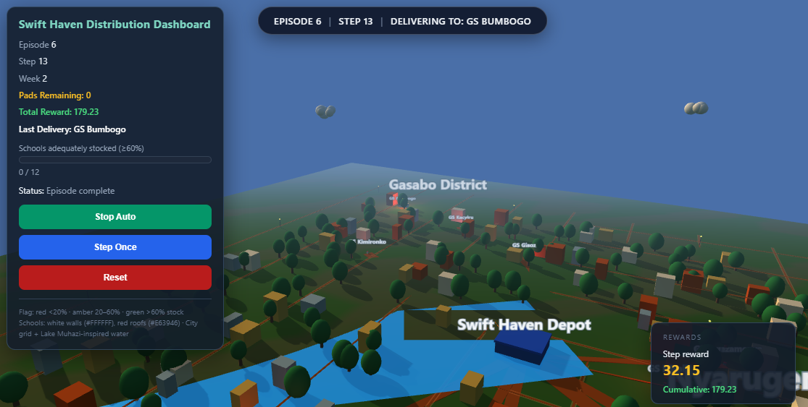
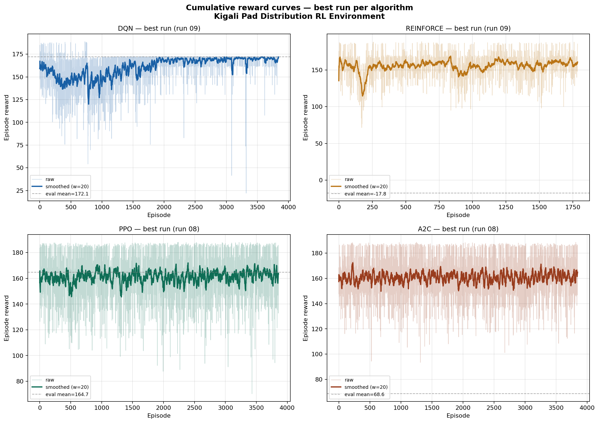
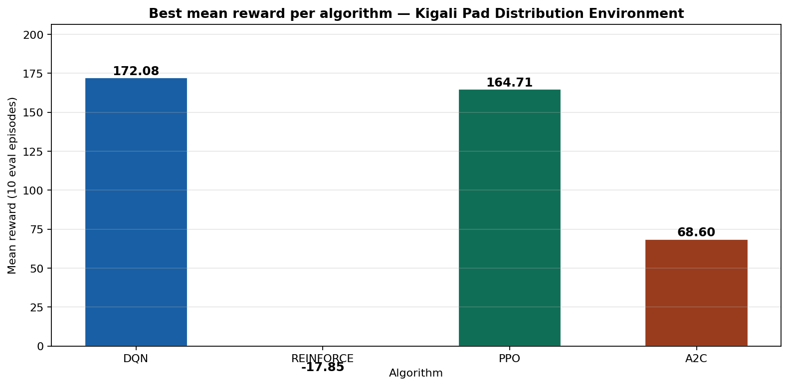
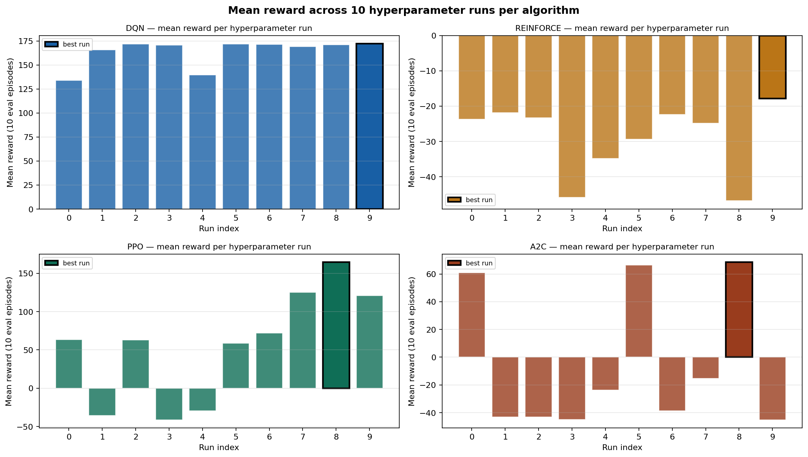
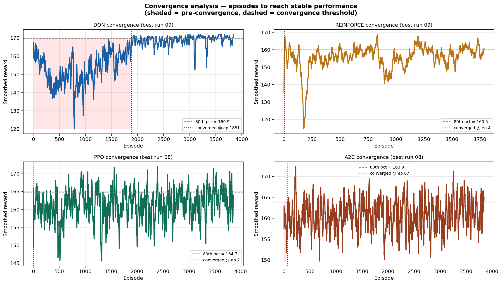
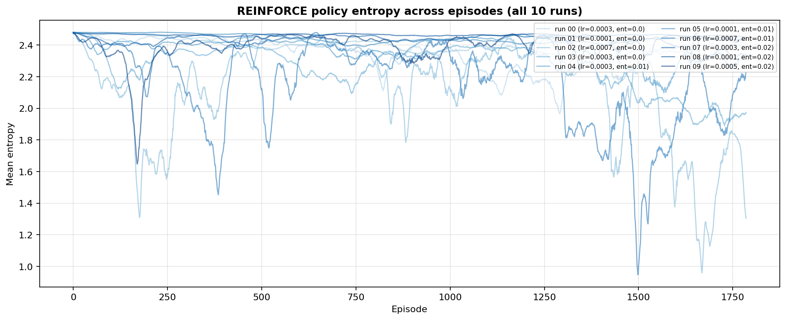
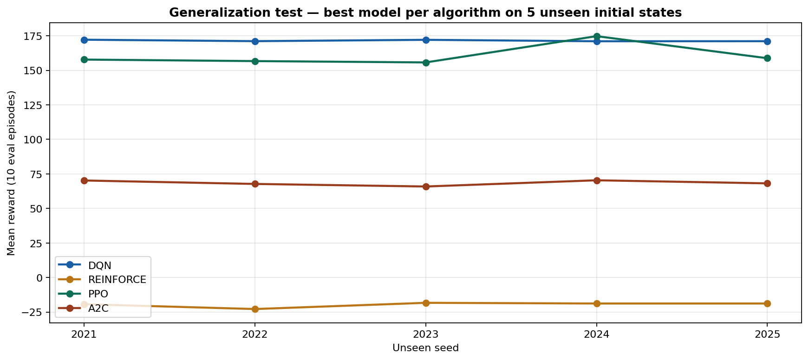

<div align="center">

# KigaliPadDistributionEnv — Reinforcement Learning for Menstrual Pad Distribution in Rwanda


**Train a distribution agent to allocate limited sanitary pads across twelve Kigali-area schools—balancing need, vulnerability, distance, and depot stock.**

[](https://www.youtube.com/watch?v=PLACEHOLDER) · 
<p align="center">
  
  <br />
  <em>Three.js + FastAPI at <code>localhost:8080</code> with best DQN (<code>main.py</code>): episode/step, depot, deliveries, district labels (e.g. Gasabo).</em>
</p>

</div>

---

## 📌 Project Overview

### The real-world problem

**Period poverty** affects many learners in Rwanda: when menstrual products are unavailable, students—especially girls—may **miss school**, fall behind, and face stigma. Logistics matter: NGOs have **finite stock and budget**, so choosing **which schools to serve first** is a hard planning problem.

### Swift Haven Africa context

**Swift Haven Africa**  is a social enterprise addressing period poverty through **IoT-enabled sanitary dispensers** in schools. This project models the role of a **distribution coordinator**: at each decision step, the agent chooses **one school** to receive a delivery from a central depot, under realistic constraints (distance, demand, vulnerability, stock).

### The RL solution

A **custom Gymnasium** environment, **`KigaliPadDistributionEnv`**, simulates **12 schools** across **Gasabo**, **Nyarugenge**, and **Kicukiro**-inspired layouts. A reinforcement learning agent learns a policy that tends to:

- Serve **low-stock, high-need** schools first  
- Avoid wasting deliveries on **already well-stocked** sites  
- Trade off **travel distance** against impact  
- Complete **high-vulnerability coverage** when possible  

📺 **Video walkthrough:** [Video Demo](https://www.youtube.com/watch?v=PLACEHOLDER) *(replace with your published link)*

---

## 🧩 Environment Design

### Agent description

The agent is a **discrete delivery planner**: once per simulated day (step), it selects **exactly one school** to receive a shipment from the depot (up to per-step capacity, depot limits, and remaining school capacity).

### Action space — `Discrete(12)`

| Index | School | District |
|:-----:|--------|----------|
| 0 | GS Kimironko | Gasabo |
| 1 | GS Kacyiru | Gasabo |
| 2 | GS Gisozi | Gasabo |
| 3 | GS Bumbogo | Gasabo |
| 4 | GS Nyamirambo | Nyarugenge |
| 5 | GS Kigali | Nyarugenge |
| 6 | GS Rwezamenyo | Nyarugenge |
| 7 | GS Mageragere | Nyarugenge |
| 8 | GS Kanombe | Kicukiro |
| 9 | GS Gikondo | Kicukiro |
| 10 | GS Niboye | Kicukiro |
| 11 | GS Nyarugunga | Kicukiro |

### Observation space — `Box(48,)`

Observations are **12 schools × 4 features**, **flattened** and **normalized to [0, 1]** (see `environment/custom_env.py`).

| # | Feature (per school) | Meaning |
|---|----------------------|---------|
| 1 | Stock level | Current stock ÷ capacity |
| 2 | Weekly demand | Demand ÷ max demand (all schools) |
| 3 | Distance from depot | km ÷ max km (all schools) |
| 4 | Vulnerability | Predefined 0–1 score (poverty / remoteness proxy) |

### Reward structure

| Condition | Reward |
|-----------|--------:|
| Successful delivery (any positive delivery) | **+5** |
| Delivery when school stock **&lt; 20%** of capacity (high need) | **+10** *(stacked with +5)* |
| Delivery when school stock **&gt; 80%** of capacity (overstocked) | **−5** |
| Distance penalty | **−2 ×** (normalized distance to chosen school) |
| Per-step efficiency penalty | **−1** |
| Episode bonus: **all high-vulnerability schools** (vulnerability **&gt; 0.7**) received **at least one** delivery before episode end | **+20** |

### Start state

- **Depot:** 500 pads  
- **Schools:** random **low** initial stock (**0–30%** of capacity each)  
- **Week / step:** week 1, step 0  

### Terminal conditions

Episode ends when **any** of the following holds:

- **Depot empty** (no pads left), or  
- **All schools** at **≥ 60%** stock ratio (adequate coverage), or  
- **28 steps** elapsed (**4 weeks × 7 days**) — **truncation**  

**Maximum episode length:** 28 steps.

---

## 🤖 RL Algorithms

All algorithms train on the **same** `KigaliPadDistributionEnv` (no environment tweaks per method). Policies use **Stable-Baselines3** defaults unless noted (**`MlpPolicy`**, typically **two hidden layers of 256 units** for DQN / on-policy methods).

| Algorithm | Policy / architecture | Training timesteps (per sweep run) | Best hyperparameters (winning run) |
|-----------|------------------------|-----------------------------------|-----------------------------------|
| **DQN** | MLP Q-network (`MlpPolicy`) | **50,000** | lr **0.0004**, γ **0.98**, replay buffer **50,000**, batch **128**, exploration fraction **0.3** |
| **PPO** | MLP actor–critic | **50,000** | lr **0.0003**, clip **0.2**, `n_steps` **512**, `ent_coef` **0.02**, `n_epochs` **15** |
| **A2C** | MLP actor–critic | **50,000** | lr **0.0001**, γ **0.97**, `n_steps` **20**, `vf_coef` **0.7**, `ent_coef` **0.01** |
| **REINFORCE** | Custom episodic policy gradient (see notebook) | **50,000** | lr **0.0005**, γ **0.99**, `ent_coef` **0.02** |

> **Note:** Ten hyperparameter combinations were evaluated per algorithm (**40 runs total**). The table above shows the **best-performing** settings recorded in `results/best_per_algo.csv`.

---

## 📊 Results Summary

| Algorithm | Best mean reward | Notes |
|-----------|-----------------:|-------|
| **DQN** | **172.08** | 🏆 **Winner** — stable value learning with replay |
| **PPO** | **164.71** | Strong second; entropy helps exploration |
| **A2C** | **68.60** | Higher variance, weaker on sparse structure |
| **REINFORCE** | **−17.85** | High variance; struggled vs. shaped sparse signals |

**Key finding:** **DQN** dominated this discrete logistics task. **Experience replay** and **off-policy** updates appear to stabilize learning when rewards mix **dense step penalties** with **sparse bonuses** (e.g. high-vulnerability coverage). On-policy methods (especially **REINFORCE**) were more sensitive to variance and credit assignment over short episodes.

---

## 📈 Plots & graphs

All figures below are stored in **`plots/`** and are produced from the training logs under **`results/`** (see `notebooks/model-training.ipynb`). Paths are **relative to the repo root** so they render on GitHub and in local Markdown viewers.

### Cumulative reward curves (four algorithms)

Mean or episodic reward over training—**DQN**, **PPO**, **A2C**, and **REINFORCE** on the same environment.

<p align="center">
  
</p>

### Algorithm comparison

Side-by-side view of final or best-run performance across methods.

<p align="center">
  
</p>

### Hyperparameter sweep rewards

Reward across the **10 hyperparameter trials** per family (from the coursework sweep).

<p align="center">
  
</p>

### Convergence & training dynamics

Episodes-to-threshold or stability-style plots (includes objective / loss-style panels where applicable).

<p align="center">
  
</p>

### Policy-gradient entropy (REINFORCE)

Entropy trajectory for **REINFORCE** runs—useful for diagnosing exploration collapse vs. sustained stochasticity.

<p align="center">
  
</p>

### Generalization test

Performance on **held-out / unseen initial states** after training.

<p align="center">
  
</p>

| File | Role |
|------|------|
| `plots/cumulative_reward_curves.png` | Learning curves — all four algorithms |
| `plots/algorithm_comparison.png` | Aggregate comparison |
| `plots/hyperparameter_sweep_rewards.png` | 10-run sweeps per algorithm |
| `plots/convergence_plots.png` | Convergence / loss-style diagnostics |
| `plots/reinforce_entropy_curves.png` | REINFORCE entropy |
| `plots/generalization_test.png` | Out-of-distribution initial conditions |

---

## 🌆 3D Visualization

A **browser-based** scene built with **Three.js** (r128) talks to a **FastAPI** backend that exposes the live environment state.

### What you see

- **Kigali-inspired** layout: **hills**, **red dirt roads**, **colored** city blocks, water body, **district labels**  
- **12 schools:** distinctive **white walls**, **red roofs**, **flagpoles** with stock-colored flags, **height ∝ vulnerability**  
- **Depot**, **delivery vehicle** with **trail**, **HUD** (episode, step, reward, progress)  


### How it works

1. **FastAPI** (`environment/rendering.py`) serves **`GET /state`**, **`POST /step`**, **`POST /reset`**, and static **`/static/...`** / **`GET /`** for the UI.  
2. **`VisualizationBridge`** holds a **thread-safe** copy of env state. **`python main.py`** loads **`models/dqn/dqn_run_09.zip`** (best DQN) for **`POST /step`**. Running **`uvicorn ... create_app`** with no bridge uses a **heuristic** instead (no checkpoint).  
3. **`visualization/index.html`** **polls `/state` every 500 ms** and lerps the truck between normalized coordinates.  

**Random-action demo (no model):** open **`http://localhost:8080/random-demo`** or **`/static/random_demo.html`**. The UI matches the main scene but **`POST /step_random`** samples a **uniform random school** each step (assignment requirement: visualize env without training).

```bash
# Local API + UI (default port 8080)
uvicorn environment.rendering:create_app --factory --host 0.0.0.0 --port 8080
# Or:
python main.py
```

---

## ⚙️ Installation & Usage

### Clone and install

```bash
git clone git@github.com:1heodora-e/theodora-rl-summative.git
cd theodora-rl-summative
python -m venv .venv
# Windows: .venv\Scripts\activate
# macOS/Linux: source .venv/bin/activate
pip install -r requirements.txt
```

### Run the visualization (recommended paths)

| Context | Steps |
|--------|--------|
| **Kaggle** | Upload this repo (or attach as a **Dataset**), open **`notebooks/model-training.ipynb`** or **`notebooks/kaggle_visualization.py`**, enable **GPU** for training; for the live 3D demo use **`kaggle_visualization.py`** with your saved **`models/dqn/dqn_run_09.zip`** and optional **pyngrok** tunnel. **Note:** Some Windows setups block NumPy DLLs via **Application Control / Defender**; Kaggle avoids that. |
| **Local** | From repo root: **`python main.py`** (loads best **DQN**; requires **`models/dqn/dqn_run_09.zip`**) → **`http://localhost:8080`**. For API without a model (heuristic stepping), use `uvicorn environment.rendering:create_app --factory --host 0.0.0.0 --port 8080`. |

**Dependencies (high level):** `gymnasium`, `stable-baselines3`, `torch`, `fastapi`, `uvicorn`, `matplotlib`, `pandas`, … — see **`requirements.txt`**.

---

## 📁 Project Structure

```
theodora-rl-summative/
├── CURSOR_CONTEXT.MD          # Author / assignment context for development
├── README.md
├── main.py                    # FastAPI + uvicorn; loads best DQN (dqn_run_09.zip)
├── requirements.txt
├── environment/
│   ├── custom_env.py          # KigaliPadDistributionEnv (Gymnasium)
│   └── rendering.py           # FastAPI app, VisualizationBridge, /state /step /reset
├── notebooks/
│   ├── model-training.ipynb   # Full 40-run training + exports (Kaggle GPU)
│   └── kaggle_visualization.py # DQN + FastAPI + optional pyngrok on Kaggle
├── docs/
│   └── images/
│       ├── README.md           # Notes for the dashboard capture
│       └── viz-dashboard.png   # README hero — 3D UI screenshot
├── visualization/
│   ├── index.html             # Three.js UI (`/step` = DQN via main.py, else heuristic)
│   └── random_demo.html       # Same scene; random actions only (`/step_random`)
├── models/
│   ├── dqn/                   # Saved DQN .zip checkpoints (e.g. dqn_run_09.zip)
│   └── pg/                    # PPO, A2C, REINFORCE artifacts (as produced on Kaggle)
├── results/                   # CSV logs: per-run rewards, entropy, aggregates
└── plots/                     # Figures: rewards, sweeps, convergence, entropy, generalization
```

---

## 🏋️ Training

- **Hardware:** Training was run on **Kaggle GPU (NVIDIA T4)** via **`notebooks/model-training.ipynb`**.  
- **Scope:** **50,000 timesteps** per configuration; **10** hyperparameter trials × **4** algorithms = **40** runs.  
- **Kaggle:** Publish your copy of the notebook and replace the badge link at the top of this README — e.g.  
  `https://www.kaggle.com/code/<your-username>/<your-notebook-slug>`  

### Optional local script layout

If you maintain standalone scripts (coursework layout), run from the repository root with your venv activated:

```bash
python training/dqn_training.py    # DQN sweeps → models/dqn, results/*.csv
python training/pg_training.py       # REINFORCE, PPO, A2C → models/pg, results/*.csv
```

*This repository’s canonical training artifact is **`notebooks/model-training.ipynb`**. Add a `training/` package if you split the notebook into modules.*

---

## 🔑 Key Findings

1. **DQN fits discrete logistics:** Off-policy data reuse dampens noise from **−1** step penalties and **distance** costs.  
2. **PPO is competitive:** Entropy and clipped updates encourage **broad school coverage** before exploitation.  
3. **A2C shows high variance:** Short episodes and correlated updates make **mean performance** less stable than DQN/PPO.  
4. **REINFORCE underperforms:** Classic **Monte Carlo** variance on **sparse / delayed** structure hurts in this setting.  
5. **Emergent prioritization:** Despite no hard-coded rule, strong agents gravitate toward **high-vulnerability** and **low-stock** schools—aligned with the reward design.

---

## 🌍 Real-World Impact

**Swift Haven Africa** scales dignified menstrual health access through **hardware in schools** and **data-informed logistics**. A system like this could:

- Suggest **next-day delivery routes** or **warehouse allocations** under stock constraints  
- Combine with **real dispenser telemetry** (future work) for **observations** closer to live stock  
- Extend beyond Kigali to **national** or **cross-border** programs across **Rwanda** and similar contexts in **Africa**  

This repository is an **academic RL sandbox**; production deployment would require **real data**, **constraints** (roads, customs, budgets), and **governance**—but the **problem framing** matches genuine **last-mile social logistics**.


---

## 📚 References & credits

- **Gymnasium** — Farama Foundation  
- **Stable-Baselines3** — RL implementations  
- **Environment & visualization** — Theodora Egbunike, ALU / Swift Haven Africa (RL Summative, 2026)  

---

<div align="center">

**Built with ❤️ for learners in Rwanda and everywhere period dignity is still a fight.**

</div>
